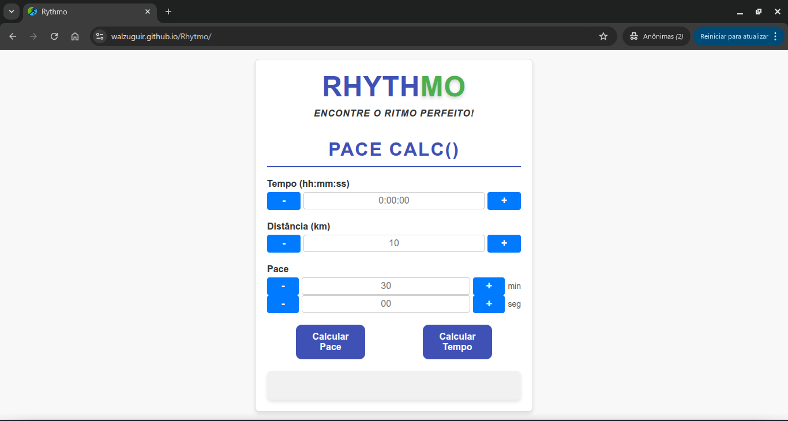

# Rhythmo

Calculadora de pace de corrida — uma aplicação web que ajuda corredores a encontrar o ritmo ideal. Baseada no tempo e na distância percorrida, calcula o pace em min/km. E o inverso também: informando o pace e a distância, calcula o tempo total de corrida.

Projeto open-source, feito com HTML, CSS e JavaScript puro (sem frameworks).

  

## Funcionalidades

- **Cálculo de pace**: a partir do tempo total (hh:mm:ss) e da distância, retorna o ritmo em min/km.
- **Cálculo de tempo**: a partir do pace e da distância, retorna quanto tempo levaria a corrida.
- **Formatação automática** do campo de tempo: os dois-pontos (hh:mm:ss) são inseridos enquanto o usuário digita.
- **Botões de + / −** em cada campo, com lógica de "virada" no tempo (59s → passa para o minuto seguinte, e assim por diante).
- **Validação de entrada**: impede caracteres não numéricos e avisa quando o tempo, o pace ou a distância estão inválidos.

## Como usar

Por ser um site estático, basta abrir o `index.html` no navegador. Ou, via GitHub Pages, acessar pelo link.

Preencha tempo e distância e clique em **Calcular Pace** — ou preencha pace e distância e clique em **Calcular Tempo**.

## Tecnologias

- **HTML** — estrutura do formulário.
- **CSS** — estilização, uso de variáveis CSS (custom properties) e layout responsivo via media queries.
- **JavaScript** — toda a lógica de cálculo, formatação e validação, sem bibliotecas externas.

## Destaques técnicos

- **Cálculo bidirecional**: as fórmulas de pace e de tempo são o inverso uma da outra, cobrindo os dois casos de uso de quem treina.
- **Manipulação de tempo** convertendo tudo para segundos antes de calcular, evitando erros de arredondamento entre horas, minutos e segundos.
- **Máscara de input em tempo real**, formatando o campo de tempo conforme o usuário digita.
- **Variáveis CSS** centralizando cores, espaçamentos e sombras num só lugar, facilitando a manutenção do tema.
